# Awesome Reservoir Management

> **The definitive curated list of reservoir management software** — commercial platforms (SaaS/hosted) and open-source GitHub projects for **reservoir simulation**, **geological & reservoir modeling**, **seismic interpretation**, **well test analysis**, **history matching**, **uncertainty quantification**, and integrated subsurface decision-making in **oil & gas**, **geothermal**, and **CO₂ storage (CCS)**.

**Who this is for:** reservoir engineers, geoscientists, simulation specialists, petrophysicists, and subsurface digital teams evaluating E&P software — from industry suites like SLB Petrel, Halliburton DecisionSpace 365, Emerson Roxar RMS, KAPPA Workstation, CMG, and Rock Flow Dynamics tNavigator, to open-source simulators and toolkits like OPM Flow, MRST, ResInsight, ERT, and JutulDarcy.jl.

**Topics covered:** reservoir simulation software · black-oil & compositional simulators · geomodeling · Eclipse-format decks · seismic interpretation · well-test analysis · production forecasting · history matching & EnKF/ES-MDA · 4D seismic · pore-network modeling · digital rock physics · CO₂ sequestration · geothermal reservoirs · PVT & SCAL · FMU workflows · subsurface data science.

## Table of Contents

- [Market Overview](#market-overview)
- [SaaS/Hosted / Commercial Platforms](#saas-hosted--commercial-platforms)
- [Open-Source GitHub Projects](#open-source-github-projects)
- [How to Contribute](#how-to-contribute)
- [Disclaimer](#disclaimer)
- [Star History](#star-history)

## Market Overview

> **Estimated market size**: The global reservoir simulation & reservoir management software market is valued at roughly **US$2.1–3.8 billion (2025–2026)** and is projected to reach **US$5.8–7.1 billion by 2034–2035** (~7–12% CAGR), depending on analyst scope.
>
> **Structure: highly concentrated (winner-take-most).** The integrated geoscience-to-simulation layer is dominated by a handful of majors — SLB (Petrel/Delfi), Halliburton Landmark, Emerson/AspenTech (Roxar RMS, SKUA-GOCAD), Rock Flow Dynamics (tNavigator), and CMG — which together capture the large majority of operator spend. Niche specialists (KAPPA, Ikon Science/Petrosys, S&P Global Kingdom) compete in well-test analysis, QI/mapping, and interpretation pockets, while open-source stacks (OPM, MRST, ResInsight) are the main non-commercial alternative.

## SaaS/Hosted / Commercial Platforms

Sorted by **company size** (latest reported revenue / valuation), largest first. Pricing and free-tier info is from vendor pages, license-optimization vendors, and published reports (September 2026); enterprise quotes dominate this market, so exact figures are noted where they are publicly reported.

| # | Platform | Vendor | Focus | Pricing (starting tier) | Free tier / free trial | Company size (revenue / valuation) |
|---|----------|--------|-------|-------------------------|------------------------|-------------------------------------|
| 1 | [SLB Petrel](https://www.software.slb.com/products/petrel) | SLB | Integrated subsurface platform: seismic interpretation, geomodeling, reservoir engineering, field development | Subscription via Delfi domain profiles: **~US$30,000–50,000/user/yr** (per Open iT, 2025); legacy perpetual buy-in **~US$100,000** + annual maintenance | No public free tier; Delfi trial/demo on request | SLB: **US$35.7B revenue (2025)** |
| 2 | [JewelSuite](https://www.bakerhughes.com/) | Baker Hughes | Geomechanics, earth modeling, structural modeling & wellbore stability | Quote-based enterprise licenses (perpetual + maintenance); per-core HPC licensing | No public free tier; trial license on request | Baker Hughes: **US$27.7B revenue (2025)** |
| 3 | [DecisionSpace 365](https://www.halliburton.com/en/software/decisionspace-365-enterprise) | Halliburton Landmark | Cloud E&P suite: interpretation, earth modeling, reservoir management, drilling | Cloud subscription, usage-based credits via [DS365.io](https://decisionspace365.io/) (no public list price) | **15-day free trial** of DS365 cloud apps | Halliburton: **US$22.2B revenue (2025)** |
| 4 | [Roxar RMS / SKUA-GOCAD / Geolog](https://www.emerson.com/) | Emerson (AspenTech) | Reservoir characterization & modeling, 3D geomodeling, petrophysics, QI | Quote-based (perpetual + annual maintenance, or subscription) | No public free tier; academic licenses granted case-by-case | Emerson: **~US$17.5B revenue (FY2024)** |
| 5 | [Kingdom](https://www.spglobal.com/) | S&P Global | Seismic interpretation, geologic interpretation & mapping | Quote-based enterprise subscriptions (Market Intelligence platform tiers start ~US$30k/yr) | No public free tier; personalized demo only | S&P Global: **US$15.3B revenue (2025)**; ~**US$121B market cap** |
| 6 | [AspenTech Subsurface (Paradigm) suites](https://www.aspentech.com/) | AspenTech (Emerson) | Additional 3D geological modeling, petrophysics, mapping & quantitative interpretation | Quote-based subscription (typical enterprise seat ~US$10k+/yr) | No public free tier; demo on request | AspenTech: **~US$1.1B revenue (FY2024)**, now wholly Emerson-owned |
| 7 | [CMG (IMEX, GEM, STARS)](https://www.cmgl.ca/) | Computer Modelling Group (TSX: CMG) | Specialized reservoir simulation: black-oil, compositional, thermal, advanced recovery | Quote-based; perpetual + annuity/maintenance licenses (98–99% license retention per FY2024 report) | No public free tier; trial license for qualified organizations | CMG: **US$87.9M revenue (FY2024)**; ~US$208M EV |
| 8 | [KAPPA Workstation](https://www.kappaeng.com/) | KAPPA Engineering | Well-test analysis (Saphir), dynamic flow modeling (Rubis), production analysis | Entry licenses from **~US$5,000** (one-time + maintenance); full price list behind validated login at [kappaeng.com/prices](https://www.kappaeng.com/prices) | Free **KAPPA Viewer** for all products; trial license on request | Private; est. **~US$50M+ revenue** |
| 9 | [Petrosys PRO / RokDoc](https://ikonscience.com/) | Ikon Science (Carina Group) | Mapping, surface modeling, geopressure, rock physics & QI | Quote-based subscriptions; bundles priced per module | No public free tier; demo/trial on request | PE-backed (acquired by Carina, 2025); est. **<US$50M revenue** |
| 10 | [tNavigator](https://rfdyn.com/) | Rock Flow Dynamics | High-performance static+dynamic reservoir simulation with AI/automation; license price independent of core count | Quote-based (pricing independent of cores used; licenses local or network) | No public free tier; trial license via local representative | **US$33.8M ARR** (Latka, 2026) |

## Open-Source GitHub Projects

Sorted by **GitHub_Stars** (descending). The Stars_Badge links to each repo's stargazers page. Star counts via shields.io, September 2026.

| # | Project | Description | Github_Stars |
|---|---------|-------------|-------|
| 1 | [MOOSE](https://github.com/idaholab/moose) —  | Idaho National Laboratory's multiphysics finite-element framework; PorousFlow and geothermal reservoir modules for flow, mechanics and thermal simulation |  |
| 2 | [GemPy](https://github.com/gempy-project/gempy) —  | Python-based implicit 3-D structural geological modeling — folded structures, fault networks, unconformities, with stochastic uncertainty workflows |  |
| 3 | [FEniCS / DOLFINx](https://github.com/FEniCS/dolfinx) —  | General finite-element solver framework widely used in research for poroelasticity, flow and transport in porous media |  |
| 4 | [SimPEG](https://github.com/simpeg/simpeg) —  | Simulation and parameter estimation in geophysics — forward/inverse modeling for EM, gravity, DC resistivity and induced polarization |  |
| 5 | [segyio](https://github.com/equinor/segyio) —  | Fast SEGY seismic file reading/writing library (Equinor) for handling seismic volumes from Python, MATLAB and C |  |
| 6 | [OpenPNM](https://github.com/PMEAL/OpenPNM) —  | Pore-network modeling framework for simulating transport (flow, diffusion, reaction) in porous media from images or networks |  |
| 7 | [PyLops](https://github.com/PyLops/pylops) —  | Linear-operator library for large-scale geophysical inverse problems (migration, regularization, tomography) |  |
| 8 | [Gimli](https://github.com/gimli-org/gimli) —  | Geophysical Inversion and Modelling Lab — ERT/resistivity inversion and related near-surface geophysics workflows |  |
| 9 | [PoreSpy](https://github.com/PMEAL/PoreSpy) —  | Image-analysis toolbox for digital rock physics — porosity, tortuosity and permeability estimation from pore-space images |  |
| 10 | [SeisSpace / ProMAX](https://github.com/ahay/src) —  | Landmark's free SeisSpace/ProMAX seismic processing package (source community edition) — legacy interpretation & processing workflows |  |
| 11 | [PorePy](https://github.com/pmgbergen/porepy) —  | Python framework for mixed-dimensional simulation of fractured and porous media (Darcy/elliptic, transport, poromechanics) |  |
| 12 | [GEOS](https://github.com/GEOS-DEV/GEOS) —  | LLNL/NVIDIA HPC multiphysics framework: geomechanics, porous-media flow, CO₂ storage & geothermal at reservoir scale |  |
| 13 | [Reaktoro](https://github.com/reaktoro/reaktoro) —  | Unified chemical modeling of multiphase reactions — CO₂-water-rock interaction and brine geochemistry for storage studies |  |
| 14 | [ResInsight](https://github.com/OPM/ResInsight) —  | Open-source 3D visualization, curve plotting and post-processing for Eclipse/OPM reservoir models; tightly integrated with OPM Flow |  |
| 15 | [OPM Flow (opm-simulators)](https://github.com/OPM/opm-simulators) —  | Fully implicit black-oil (and extended) simulator handling industrial-complexity Eclipse-format models; CO₂/H₂ storage and thermal options; used operationally |  |
| 16 | [ERT](https://github.com/equinor/ert) —  | Equinor's ensemble-based history matching & reservoir management tool (Ensemble Smoother, ES-MDA) used on real assets |  |
| 17 | [JutulDarcy.jl](https://github.com/sintefmath/JutulDarcy.jl) —  | Julia-based, fully differentiable high-performance porous-media/reservoir simulator on the Jutul framework — research, optimization, ML-adjacent workflows |  |
| 18 | [MRST – MATLAB Reservoir Simulation Toolbox](https://github.com/SINTEF-AppliedCompSci/MRST) —  | SINTEF toolbox for prototyping porous-media flow: grids, discretizations, black-oil, compositional, EOR, CO₂, geomechanics, adjoint optimization |  |
| 19 | [OpendTect](https://github.com/OpendTect/opendtect) —  | Open-source seismic interpretation platform with rich plugin ecosystem (free core, incl. commercial use; Pro tier ~US$2,200/user/yr) |  |
| 20 | [resdata](https://github.com/equinor/resdata) —  | Equinor's library for reading/writing Eclipse output files (summary, grid, restart) — successor of libecl |  |
| 21 | [xtgeo](https://github.com/equinor/xtgeo) —  | Python library for reservoir geometry objects — grids, surfaces, wells, cubes — core of Equinor's FMU workflows |  |
| 22 | [OPM Flow test data](https://github.com/OPM/opm-data) —  | Eclipse-format test & real-field datasets (e.g. Norne, SPE benchmarks) used to validate OPM Flow and other simulators |  |
| 23 | [Pyscal](https://github.com/equinor/pyscal) —  | Python library for SCAL analysis: relative permeability & capillary pressure interpolation and uncertainty workflows |  |
| 24 | [Webviz Subsurface](https://github.com/equinor/webviz-subsurface) —  | Equinor's dashboards for subsurface/FMU workflows: visualization of ensembles, well logs, maps and simulation results |  |
| 25 | [UM-Bridge](https://github.com/UM-Bridge/umbridge) —  | Universal Multi-physics Bridge: HTTP-based interface linking simulators with UQ and Bayesian inversion frameworks |  |
| 26 | [opm-common](https://github.com/OPM/opm-common) —  | Core OPM library: Eclipse-format deck parsing, keyword definitions and tools underpinning OPM Flow |  |
| 27 | [PyJutulDarcy](https://github.com/sintefmath/PyJutulDarcy) —  | Python wrapper for JutulDarcy (`pip install jutuldarcy`) — run .DATA decks from pure Python |  |
| 28 | [DUNE (dune-common)](https://github.com/dune-project/dune-common) —  | Core of the DUNE PDE framework — grid/scientific-computing foundation used by DuMux for porous-media applications |  |
| 29 | [libres](https://github.com/equinor/libres) —  | Ensemble-based reservoir modeling/assimilation tool — predecessor of ERT for history matching |  |
| 30 | [subscript](https://github.com/equinor/subscript) —  | Collection of Equinor Python utilities for FMU/reservoir modeling workflows (Eclipse deck manipulation, QC, etc.) |  |
| 31 | [opm-material](https://github.com/OPM/opm-material) —  | OPM framework for fluid and rock property (PVT, relative permeability, capillary pressure) models |  |
| 32 | [opm-upscaling](https://github.com/OPM/opm-upscaling) —  | OPM workflows for single- and two-phase upscaling of rock properties on geomodel grids |  |
| 33 | [semeio](https://github.com/equinor/semeio) —  | Equinor's seismic-to-simulation jobs and utilities for ensemble/FMU history-matching workflows |  |

### Additional Strong Open-Source Options

- **Grid generation & upscaling**: OPM (`opm-upscaling`) and MRST modules for corner-point, unstructured, and fractured-media grids; PorePy for mixed-dimensional fracture networks.
- **Ensemble & uncertainty workflows**: ERT/libres (history matching), UM-Bridge (UQ surrogates), and MRST adjoint-based optimization.
- **CO₂ / geothermal extensions**: GEOS, MOOSE (PorousFlow) and OPM Flow storage modules; MRST CO₂ and geothermal packages; Reaktoro for CO₂-water-rock geochemistry.
- **Digital rock & pore-scale**: OpenPNM (pore-network transport) and PoreSpy (image-based property estimation).
- **Geophysical modeling & inversion**: SimPEG, Gimli and PyLops for potential-field, resistivity and seismic inverse problems.
- **Structural & seismic data handling**: GemPy (implicit 3-D geomodeling), segyio (SEGY I/O) and xtgeo/resdata (grid, well and Eclipse-file handling in Python).
- **Python / Julia wrappers**: PyJutulDarcy, Pyscal, subscript and Webviz embed open engines in modern data-science pipelines.
- **Seismic-to-simulation bridges**: OpendTect (+ plugins) and semeio feeding interpretation into open simulators.
- Fully open stacks combining OpendTect (interpretation) → geological modeling scripts → OPM Flow / MRST (simulation) → ResInsight (visualization).

**Frameworks for building custom systems**:  
The strongest open-source foundation is the **OPM** stack (**OPM Flow** + **ResInsight** + supporting libraries) for production-style black-oil and storage simulation, complemented by **MRST** for research, rapid prototyping, and advanced numerics.  
**OpendTect** provides an open entry point for seismic interpretation.  
**JutulDarcy.jl** offers a modern, differentiable alternative for optimization-heavy workflows.  
Commercial platforms (Petrel, DecisionSpace, Roxar RMS, tNavigator, CMG, Kingdom, etc.) deliver integrated geology-to-simulation environments, vendor support, and validated workflows required by many operators.  
Research groups, national laboratories, and increasingly some operators use OPM/MRST for simulation while retaining commercial tools for interpretation and geomodeling; fully open pipelines are feasible for many study and CO₂-storage applications.

## How to Contribute

1. Fork the repo.
2. Add/edit entries in `README.md` (follow existing format).
3. Include: name, link, 1–2 sentence description, and whether it's commercial/SaaS or open-source.
4. Submit PR with a short explanation.

Suggested repo topics for discoverability: `reservoir-management`, `reservoir-simulation`, `geoscience`, `petroleum-engineering`, `subsurface`, `geomodeling`, `ccs`, `geothermal`, `opm-flow`, `awesome-list`.

[Back to top ⬆](#readme-top)

## Disclaimer

- This is a **community-curated** list — not exhaustive and not an endorsement.
- Pricing and company-size figures are indicative, compiled from public sources (vendor pages, license-optimization vendors, analyst reports, and filings) as of September 2026, and may change without notice. Enterprise agreements frequently differ from list pricing.
- Reservoir management decisions have significant safety, environmental, and economic consequences. Simulation results must be properly validated, and regulatory or corporate standards for model quality and uncertainty handling apply.
- Open-source simulators (especially OPM Flow) have reached industrial maturity and are used on real assets, yet organizations remain responsible for verification, validation, and appropriate use. Evaluate licensing, support options, and fitness for purpose carefully.

[Back to top ⬆](#readme-top)

## Star History

[Back to top ⬆](#readme-top)

---

**Made for reservoir engineers, geoscientists, simulation specialists, and subsurface digital teams.**  
Let's advance open, high-quality tools for understanding and managing the subsurface while recognizing the continuing importance of integrated commercial platforms in operational decision-making.
